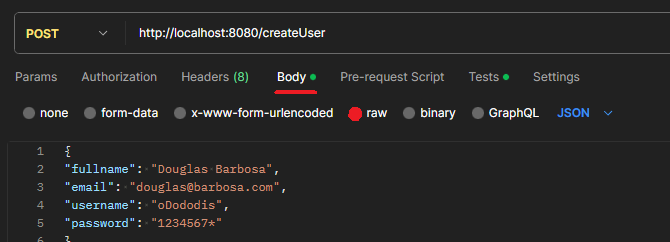
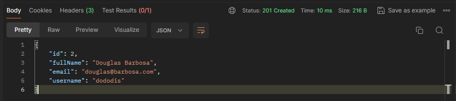
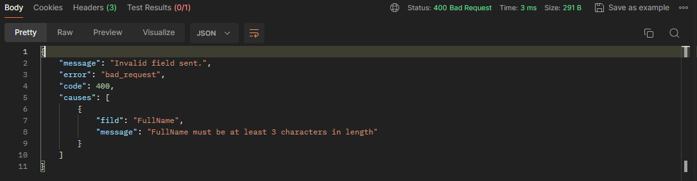
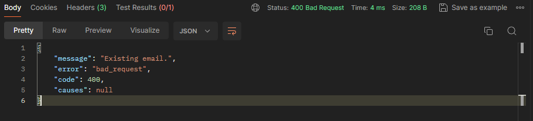
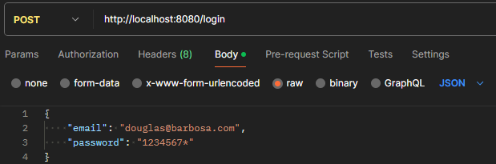
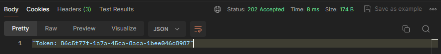
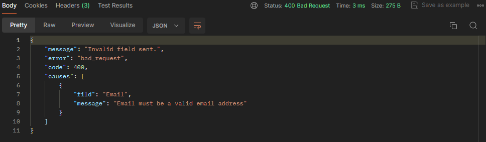
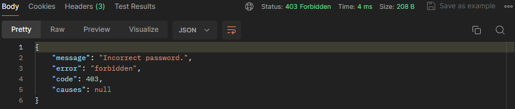
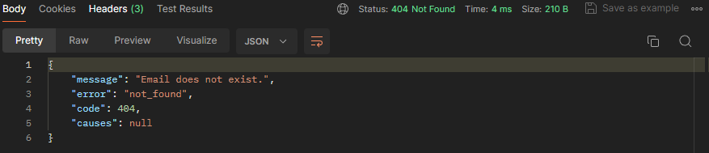

# Gerenciador de Usuario Simples.


## Item necessario para rodar-lo:
- A linguagem utilizada é: [Go](https://golang.org/dl/)
- Para enviar as requisições localmente: [Postman Desktop](https://www.postman.com/downloads/ )

## Instalação:
Para instalar é apenas clonar neste repositório:
````
git clone https://github.com/oDododis/gerenciamento-de-usuario/
cd gerenciamento-de-usuario/
````
## Inicialização:
Antes de iniciar o programa precisamos criar as tablas do banco vazias, com este comando:

````
go run migration/main.go
````

Para iniciar o gerenciador execute este comando:
````
go run main.go
````

Apos aparecer isso no console:
````
[GIN-debug] Listening and serving HTTP on :8080
````
o servidor estará aberto.

## Usando o gerenciador:
Temos as seguintes Endpoints no servidor:

### 1. **POST /createUser**
   
 Este Endpoint cria o usuário. Para criar o usuario precisamos ter as seguntes informações, com os seguntes requisitos:
  - Nome completo, com um mínimo de 3 e um máximo de 150 caracteres.
  - Email, com o formato de email.
  - Username, com um mínimo de 3 e um máximo de 150 caracteres.
  - Senha, com um mínimo de 8 caracteres e precisa conter algum dos seguites caracteres especiais: "!", "@", "#", "$", "%", "&", "*", "(", ")", "_" e "+".
 
 No Postman a requisição dos dados devem ser feita no Body e raw na formatação JSON:
 
   
 #### Exemplos:
 Usuáro 1:

        {
        "fullname": "Douglas Barbosa",
        "email": "douglas@barbosa.com",
        "username": "oDododis",
        "password": "1234567*"
        }
 Usuário 2:
        
        {
        "fullname": "Segundo Usuário",
        "email": "segundo@usuario.com",
        "username": "segUsuario",
        "password": "2222@@@@"
        }

Como resposta para casos de susseso, retornará as seguintes informações:
#### Exemplo para `Status 201 Created`:

Informaçoes colocadas corretamente:


- Responderá com as informações de ID, Nome completo, Email e Username.

Como resposta para casos de fracasso, retornará informações sobre o erro:

#### Exemplos para `Status 400 Bad Request`: 
   
O nome completo não segue as restrioções mínimas:


O email já existe no Banco de Dados:


- Responderá com as informações de com tipo de erro.

### 2. **POST /login**
Este Endpoint faz o login do usuário. Para fazer o login presiramos ter as informações parecida com a do Create User, com os serguintes requisitos:
   - Email, com o formato de email.
   - Senha, com um mínimo de 8 caracteres e precisa conter algum dos seguites caracteres especiais: "!", "@", "#", "$", "%", "&", "*", "(", ")", "_" e "+".

O email e a senha devem ser o mesmo de algum usuario ques esteje no banco de dados e a requisição deve ser feita a mesma maneira do Create User, no Body, raw e em formatação JSON:

#### Exemplo:
        {
        "email": "douglas@barbosa.com",
        "password": "1234567*"
        }
Como resposta para casos de susseso, retornará as seguintes informações:

#### Exemplo para `Status 202 Accepted`:
Informaçoes colocadas corretamente:


- Responderá com as informação do Token que sera utilizado para as requisições restantes.

Como resposta para casos de fracasso, retornará informações sobre o erro:
#### Exemplo para `Status 400 Bad Request`:
Email invalido:


#### Exemplo para `Status 403 Forbidden`:
Senha incorreta:


#### Exemplo para `Status 404 Not Found`:
Email não existe no Banco de Dados


- Responderá com as informações de com tipo de erro.

3. **PUT /updateUser/{ID do usuário}**


4. **GET /getUserID/{ID do usuário}**


5. **GET /getUserEmail/{Email do usuário}**


6. **GET /getUserList**


7. **DELETE /deleteUser/{ID do usuário}**
